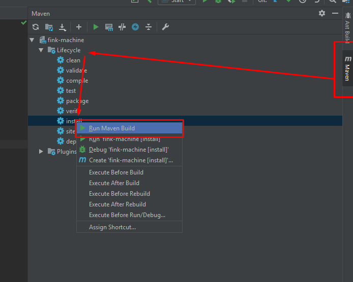

##If you are in capstone and are working on this project, email me from your IUS email at "justinbutler4@hotmail.com" with github usernames or emails so I can add you as a collaborator to the repository. Also feel free to email me if you have any issues or questions regarding the project. Read the first page of the UserManual for more information. 

### Requirements
* [Java 8+ jdk](https://www.oracle.com/technetwork/java/javaee/downloads/jdk8-downloads-2133151.html)
* [Python 3](https://www.python.org/download/releases/3.0/)
* [IntelliJ](https://www.jetbrains.com/idea/) - This project was built while using IntelliJ so all installation and project setup assumes you are also using it. You may have a bad time if you don't.
* [Java FX Scene Builder](https://www.oracle.com/technetwork/java/javase/downloads/javafxscenebuilder-info-2157684.html)
* [Chocolate (windows only)](https://chocolatey.org/)

### Installation
1. Make sure all the requirements are installed.
2. Clone the repository `https://github.com/jb1361/fink-machine.git`
3. Install maven `choco install maven -y` If you are not on windows, you can follow mavens setup instructions from [here](http://maven.apache.org/index.html).

### Building
To Build the executable jar file either run the maven build or in your terminal run `mvn package`

### Running 

To run the jar file by passing in a file you run `java -jar jarname.jar fsmname.fsm outputfilename.py` or you can double click the executable jar file.
The jar file will be located under the "target" directory.

There is a sample fsm file in the fsm-files directory.
Currently only python is supported as an output file-type so make sure to pass in a .py file as the second argument.